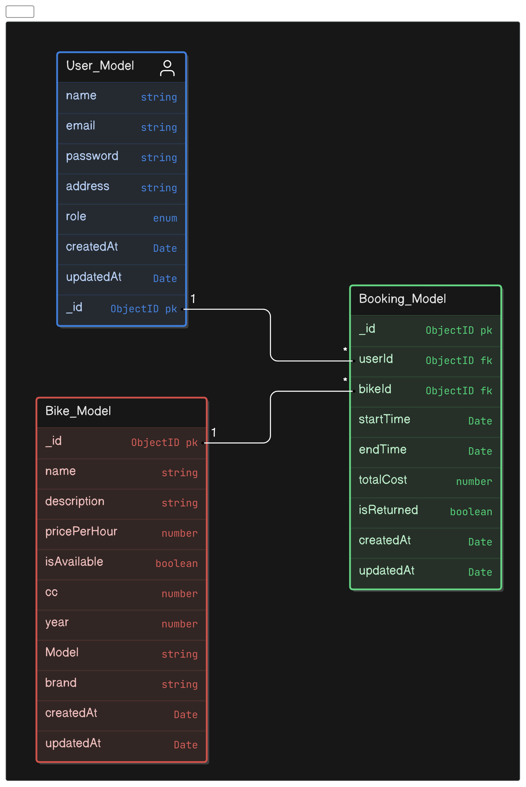

# Bike Rental Service API

Welcome to the Bike Rental Service API. This backend service allows users to rent bikes, manage their profiles, and view available bikes. Admins can manage bike inventory and handle user rentals.

## Live Link
[Bike-Rental-Service](https://bike-rental-service-node.vercel.app/)

## ER-Diagram 


## Requirement-Analysis
[Requirement-analysis](https://drive.google.com/file/d/144c1fo0Bn1OuU1FNCfvaD3X_4GpN8rRl/view?usp=drive_link)

## Table of Contents

- [Features](#features)
- [Technology Stack](#stack)
- [Installation](#installation)
- [API Endpoints](#api-endpoints)
- [Data Models](#data-models)

## Features

- **User Authentication:**
  - User Signup
  - User Login
  - Admin Signup
  - Admin Login

- **Profile Management:**
  - View Profile
  - Update Profile

- **Bike Management:**
  - View Available Bikes
  - Create, Update, Delete Bikes (Admin Only)

- **Rental Management:**
  - Rent a Bike
  - View Rental History
  - Return a Bike (Admin Only)

## Stack

- Programming Language: Typescript
- Web Framework: Express js
- Database And ODM: mongodb and mongoose

## Installation

1. Clone the repository:
   ```sh
   git clone https://github.com/minhaz1010/Bike-Rental-Service.git
   cd Bike-Rental-Service
2. npm install

## Commands 

- To run
  ``` 
  npm run start:dev

## File structure
```
/src
  |__ config
  |__ errors
  |__ middleware
  |__ modules
    |__ auth
    |__ bike
    |__ booking
    |__ user
  |__ route
  |__ utils
|__ app.ts
|__ server.ts
|__ ER.png
|__ eslint.config.mjs
|__ package-lock.json
|__ package.json
|__ README.md
|__ tsconfig.json


